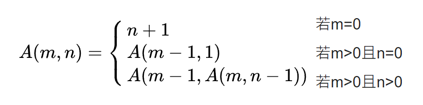

# Ackermann Function

請以遞迴實作 Ackermann 函數，已知函數敘述如下：


## 輸入

每一行有兩個數字 $m$ 跟 $n$，輸入到EOF (End of File)。

## 輸出

依據每行輸入之 $m$ 與 $n$，輸出阿克曼函數 $A(m, n)$ 的結果。

### Example Input

```plain
1 1
3 2
3 5
2 1

```

### Output

```
3
29
253
5

```
